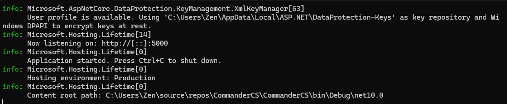
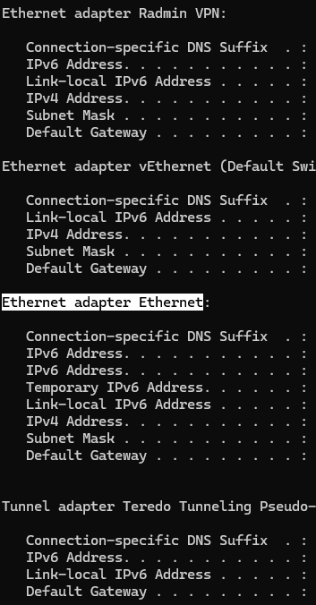

# CommanderCS

GoddessKiss Private Server Emulator (partially functioning)

### Bugs

Getting kicked out of a guild while the game still thinks you are in one will make unable to continue playing (needs to restart the game) (client-sided issue)

### Discord

[Invite Link](https://discord.gg/qz5gs47ygV)

### IMPORTANT

This is just a POC and its in WIP while it works somewhat it does has very limited usage and not everything works to 100% like its intend.

### Links

[Mongodb community database](https://www.mongodb.com/try/download/community)

Its for the database you pratically install it via all the pre selected settings iirc.

[Modified Client APK](https://www.mediafire.com/file/gp6x6c2gweggndh/com.edited.GK.apk/file)

it is the lastest Version GK had just modified so i can easier create this POC, if you have any trust issues with it, you can look at it via tools like dnSpy.

[Game OBB Data](https://www.mediafire.com/file/8cnyb7btjwk9qk0/com.flerogames.GK.rar/file)

This is just the games obb data works with any obb data for the lastest version.

### Setup

Download the files from the 3 links above.

1. You install the Mongodb Community Database, you pretty much just click next/yes to everything since you only want the standard install. Nothing more to do on your host machine (I cant provide support for anything other than Windows 10, i dont use any other OS)

2. Install the APK on your Emulator or Phone (It might be unable to be installed post Android Version 14 idk, since its an older Game, then you most likely have to use one of those Cloner Apps or anything similar if you dont have access to an Emulator or older Smartphone (if you cant install it on your Phone))

3. Now open the Game it will say you need to download the obb/it cant download the obb or something similar since you downloaded/installed it from a "non googleplay service" or so. Then close the Game, completely

4. Now you need to put the .obb file into the path "Android/Obb/com.flerogames.GK/" if you cant find this specific folder, do not panic just create the folder named "com.flerogames.GK" in that path instead and move the .obb into that folder. 

5. Download the net9.0.rar from the release section, and unpack it wherever you want it. Then run the CommanderCS.exe it should look kinda like in the picture below. Dont panic if you get an warning or anything similar. 

6. Now open the cmd (Commandline/Command Prompt), and type in "ipconfig", you might see multiplie adapters like in the picture below, now you look for your primary internet adapter, in my case it would be highlighted "Ethernet adapter Ethernet", and note down your IPv4 Address, this is your local network IP Address of your PC/Machine that the server is running on, most of the time it starts with "192.168".

7. Now you go on your emulator/device where you installed the APK on, and look for the "Pictures" folder, there should be a file "config.json", and the replace the "192.168.X.X" part with your IP Address you noted down. Keep in mind that it should look like this "http://{your_replaced_ip}:5000/checkData.php", if it doesnt look like this example here, you wont be able to connect

8. If you followed everything according to this i hope, you should be able to connect and create your own Accounts on your own private Server

### Progress

You can login, create an Account with DBUser (GooglePlay/Facebook wont be supported due the fact its an third party login), Tutorial partially works of now (12.12.2025), you can do the first like 2 steps of it but if you get to the gacha part it crashes, due missing logic/items i believe. Apart from that you can create an Guild almost all features there should work, Raid boss fights work too

## Credit

[Inso](https://github.com/insomnyawolf) For essenitaly creating this entire Project Rework +  helping me with more stuff.